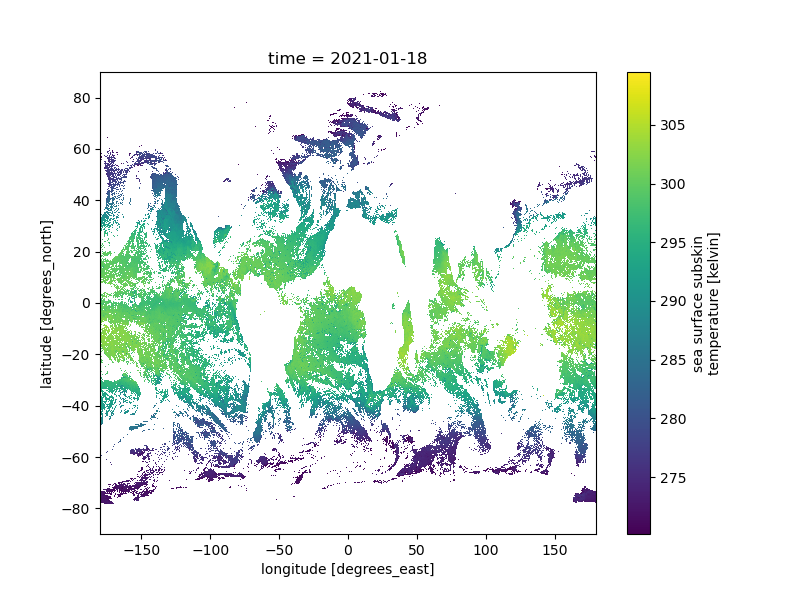
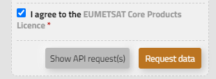
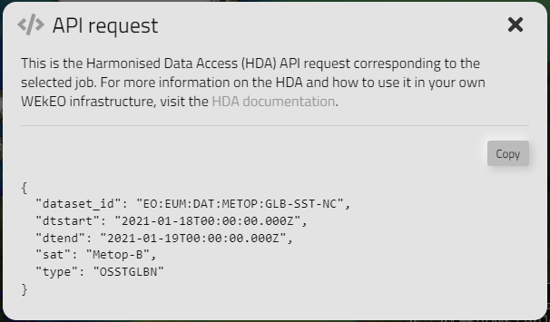

Quick start
===========

Once the plugin is installed, it can be used directly into a Jupyter notebook.

.. code-block:: python

    import climetlab as cml
    from dask.distributed import Client

    # Instantiate a default Dask distributed client to handle data
    client = Client()

    cmlds = cml.load_dataset(
    "wekeo-eum-metop-glb-sst-nc",
    dtstart="2021-01-18",
    dtend="2021-01-19",
    )

    ds = cmlds.to_xarray()
    ds.sea_surface_temperature.isel(time=0).plot()

    client.shutdown()

To ease the construct of the arguments for the `load_dataset` function, especially for those
datasets with a lot of options, you can use a utility function that transforms an HDA
API request into usable parameters.

Open the WEkEO Data web page, choose one of the supported dataset and select the parameters in
the form, then click on the **Show API request(s)** button:

On the new modal, click the **Copy** button:

Once the request is copied into the clipboard, you can use it following the example below:

.. code-block:: python

    import climetlab as cml
    from climetlab_wekeo_datasets import hda2cml

    # Instantiate a default Dask distributed client to handle data
    client = Client()

    query = {
    "dataset_id": "EO:EUM:DAT:METOP:GLB-SST-NC",
    "dtstart": "2021-01-18T00:00:00.000Z",
    "dtend": "2021-01-19T00:00:00.000Z",
    "sat": "Metop-B",
    "type": "OSSTGLBN"
    }

    entry_point, arguments = hda2cml(query)
    cmlds = cml.load_dataset(entry_point, **arguments)

    ds = cmlds.to_xarray()