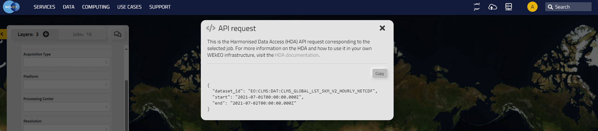
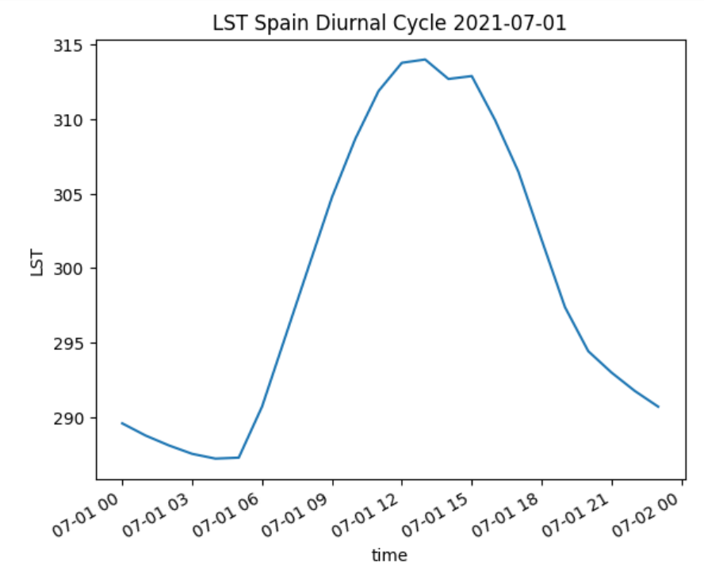
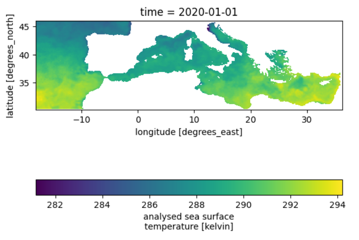
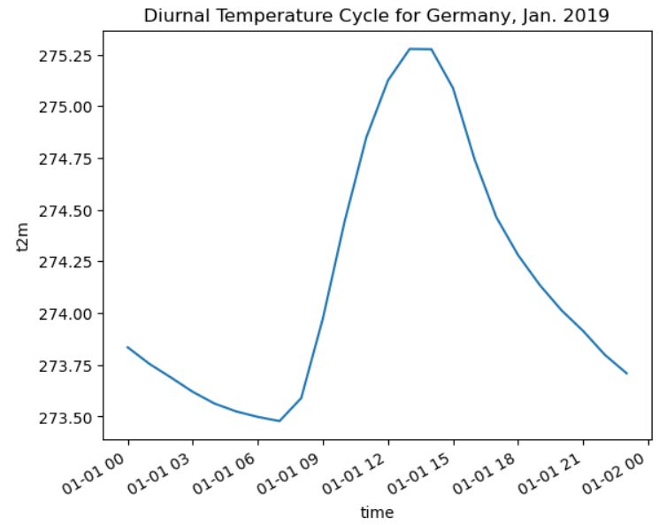
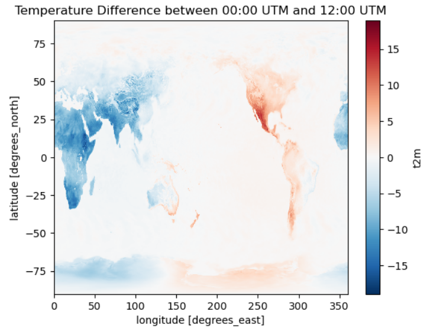
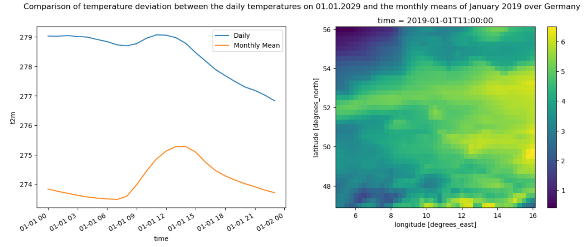
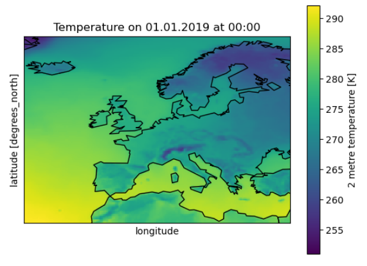

Usage
=====

Building a CliMetLab query
---------------------------------------------------------------

The WEkEO CliMetLab Plugin gives access to a wide range of WEkEO datasets. All WEkEO datasets can be explored in the  `WEkEO Viewer <https://www.wekeo.eu/data?view=viewer>`_.

The CliMetLab WEkEO Datasets Plugin currently supports a subset of datasets published by the Copernicus Land Monitoring Service (CLMS) by EEA, 
the Copernicus Climate Change Service (C3S) and Copernicus Atmosphere Service (CAMS) by ECMWF,
the Copernicus Marine Service (CMEMS) by Mercator Ocean, 
and Copernicus Sentinel Data by EUMETSAT.

A dataset can be accessed using CliMatLab with the ``load_dataset`` function.
The minimum required argument for the function ``load_dataset`` is the dataset id.

The CliMetLab dataset id can be derived from the dataset id inside the WEkEO viewer. For example:

- WEkEO dataset id: ``EO:CLMS:DAT:CLMS_GLOBAL_LST_5KM_V2_HOURLY_NETCDF``
- CliMetLab dataset id: ``wekeo-clms-clms-global-lst-5km-v1-hourly-netcdf``

.. code-block:: python

    import climetlab as cml

    ds = cml.load_dataset(
        "wekeo-clms-clms-global-lst-5km-v1-hourly-netcdf"
    )

This code will download all available data in this dataset. As this means the download of large volumes of data (not advised),
it is necessary to further subset the query by dataset attributes. There are two ways to find the available attributes for each dataset:

There are two options to build up the CliMetLab Query:
1. Using the hda2cml function
2. Explore attributes in the Plugin source code

1. Using the hda2cml function

The WEkEO CliMetLab Plugin offers a translation function which translates the WEkEO Harmonized Data Access API request to a CliMetLab query. 

.. code-block:: python

    import climetlab as cml
    from climetlab_wekeo_datasets import hda2cml

    api_request = {
        "dataset_id": "EO:CLMS:DAT:CLMS_GLOBAL_LST_5KM_V2_HOURLY_NETCDF",
        "start": "2021-07-01T00:00:00.000Z",
        "end": "2021-07-02T00:00:00.000Z"
        }

    ds_id, args = hda2cml(api_request) 

    ds = cml.load_dataset(dsid, **args)

For any WEkEO dataset avilable through the HDA, the API request can be viewerd and copied in the `WEkEO Viewer <https://www.wekeo.eu/data?view=viewer>`_.

2. Explore attributes in the Plugin source code

Each dataset is described with its attributes in a separate python file in the `plugin source code <https://github.com/wekeo/climetlab-wekeo-datasets>`_.

The above-described Land Surface Temperature (LST) dataset can be found `here <https://github.com/wekeo/climetlab-wekeo-datasets/blob/main/climetlab_wekeo_datasets/clms/cgls_hourly_lst_global_v2.py>`_.

.. note::
    Many dataset attributes are subject to selection constraints and not all combinations of attributes are possible. It is advised to check the combination of the selection in the WEkEO Viewer before creating a CliMetLab query to avoid errors of empty queries.

Now, a CliMetLab query for WEkEO data can be created:

.. code-block:: python

    import climetlab as cml

    ds = cml.load_dataset(
        "wekeo-clms-clms-global-lst-5km-v1-hourly-netcdf",
        start="2021-07-01T00:00:00Z",
        end="2021-07-01T23:59:59Z",
    )

Accessing a single dataset through CliMetLab
--------------------------------------------

This query triggers the download of a subset of a single dataset.

.. code-block:: python

    import climetlab as cml

    ds = cml.load_dataset(
        "wekeo-clms-clms-global-lst-5km-v1-hourly-netcdf",
        start="2021-07-01T00:00:00Z",
        end="2021-07-01T23:59:59Z",
    )

The download result is stored in chache. Running again the `cml.load_dataset` for the same dataset and the identical parameters will not trigger a new download, but will use the cached data instead.

After downloading, the dataset can be converted to xarray using the `to_xarray` function:

.. code-block:: python

    xarr = ds.to_xarray()
    xarr

Using the python `xarray` module, the dataset can be analyzed and plotted.

.. code-block:: python

    #create a spatial subset of the data

    lst_spain = xarr.sel( lat=slice(44.1, 35.6), lon = slice(-10, 4))[['LST']]
    lst_spain.attrs["title"] = "LST Spain 2021-07-01"

    # summarize the mean LST for the area of Spain

    lst_spain.LST.mean(dim=["lat", "lon"]).plot.line(x="time")
    plt.title ("LST Spain Diurnal Cycle 2021-07-01")

Working with two or more datasets using CliMetLab
-------------------------------------------------

In many cases it is necessary to combine more datasets and variables for data analysis.
Using the WEkEO CliMetLab Plugin, datasets from different sources can be downloaded and combined.

The LST dataset used in the previous sections is available in the date range betweel ``2021-01-18`` and today.
If we want to compare the LST of 2021-07-01 with the LST of the previous year, it is necessary to query the Version 1 of the dataset:
``wekeo-clms-cgls-hourly-lst-global-v1`` and combine it with the new version of the dataset.

.. code-block:: python

    import climetlab as cml
    import xarray as xr
    import matplotlib.pyplot as plt

    ds_v1 = cml.load_dataset(
        "wekeo-clms-clms-global-lst-5km-v1-hourly-netcdf",
        start="2020-07-01T00:00:00Z",
        end="2020-07-01T23:59:59Z",
    )

    #convert to xarray
    xarr_v1 = ds_v1.to_xarray

    #concatenate along the time dimension to have a consecutive time series
    lst = xr.concat([xarr, xarr_v1], dim="time")

    #compare the two dates within one plot
    import matplotlib.pyplot as plt

    lst_spain.groupby("time.hour").mean(dim=["lat", "lon", "time"]).LST.plot.line(x="hour", label="mean 2020 2021")
    lst_spain.isel(time=(lst_spain.time.dt.year == 2020)).groupby("time.hour").mean(dim=["lat", "lon", "time"]).LST.plot.line(x="hour", label = "2020")
    lst_spain.isel(time=(lst_spain.time.dt.year == 2021)).groupby("time.hour").mean(dim=["lat", "lon", "time"]).LST.plot.line(x="hour", add_legend = True, label="2021")
    plt.legend()
    plt.title ("LST Spain comparison 2020-07-01 and 2021-07-01")

.. image:: ../images/lst-line-comparison.png
    :width: 400

Handling Merge errors
---------------------

The ``to_xarray`` function is not supported for all datasets depending of the datasets' shape and variable names. In such cases the following error will occur:

.. error::
    MergeError: Cannot safely merge your data. Try to download a single variable or loop over the files and call `to_xarray` on each one.

The ``ECMWF:SIS:WATER:HYDROLOGICAL:CHANGE`` dataset is one example:

.. code-block:: python

    ds=cml.load_dataset(
    "wekeo-ecmwf-sis-water-hydrological-change",
    variable=[
        "air_temperature",
        "precipitation"],
    time_aggregation=["autumn", "spring"],
    format_="zip",
    gcm_model="esm_chem",
    statistic="change_in_the_annual_mean",
    experiment="rcp_8_5",
    hydrological_model="pcr_globwb")

    xarr.to_xarray()

This raises the error:

.. error::
    MergeError: Cannot safely merge your data.
    Try to download a single variable or loop over the files and call `to_xarray` on each one.
    Original exception: conflicting values for variable 'ref_var_threshold' on objects to be combined. You can skip this check by specifying compat='override'.

The original exception reveals that the datasets have identical variable names, which is why they cannot be merged to a single xarray.

A workaroud is to access the two variables separately using the climetlab, rename the variable names accordingly and merge them afterwards. 

.. code-block:: python

    dscml_temp=cml.load_dataset(
    "wekeo-ecmwf-sis-water-hydrological-change",
    variable=[
        "air_temperature"],
    time_aggregation=["autumn", "spring"],
    format_="zip",
    gcm_model="esm_chem",
    statistic="change_in_the_annual_mean",
    experiment="rcp_8_5",
    hydrological_model="pcr_globwb")

    ds_temp = dscml_temp.to_xarray()

.. code-block:: python

    dscml_prec=cml.load_dataset(
    "wekeo-ecmwf-sis-water-hydrological-change",
    variable=[
        "precipitation"],
    time_aggregation=["autumn", "spring"],
    format_="zip",
    gcm_model="esm_chem",
    statistic="change_in_the_annual_mean",
    experiment="rcp_8_5",
    hydrological_model="pcr_globwb")

    ds_prec = dscml_prec.to_xarray()

The datasets can be merged after manually changing their variable names using xarray.

.. code-block:: python

    ds_prec = ds_prec.rename({"relative_change": "prec_relative_change"})
    ds_prec = ds_prec.rename({"ref_var_threshold": "prec_ref_var_threshold"})[['prec_relative_change', 'prec_ref_var_threshold']]

    ds_temp = ds_temp.rename({"absolute_change": "temp_absolute_change"})
    ds_temp = ds_temp.rename({"ref_var_threshold": "temp_ref_var_threshold"})[['temp_absolute_change', 'temp_ref_var_threshold']]

    xarr = xr.merge([ds_prec, ds_temp])

Caching and Storage of CliMetLab datasets
-----------------------------------------

The CliMetLab source module works with caching instead of simply storing files in the local file system.
This brings the advantage that the user does not have to clean up the local disk, but the files will be removed automatically when the cache is cleared.

.. warning::

    When working with large datasets the files will fill up the computers cache, or the data cannot be fully downloaded if the queried volume does not fit fully in cache.

For large volumes of data it is recommended to change the default location where CliMetLab stores the data from cache to a large disk or object storage.
All benefits of the data management of CliMetLab remain, except the datasets are not deleted when the cache is cleared. They will be persistent on the drive instead.

.. code-block:: python

     import climetlab as cml

     cml.settings.get("cache-directory") # Find the current cache directory

     "/tmp/climetlab-$USER"

     # Change the value of the setting
     cml.settings.set("cache-directory", "/big-disk/climetlab-cache")

     # Python kernel restarted

     import climetlab as cml
     cml.settings.get("cache-directory") # Cache directory has been modified

     "/big-disk/climetlab-cache"

More information on caching can be found in the official documentation of CliMetLab (`Caching <https://climetlab.readthedocs.io/en/latest/guide/caching.html>`_).

Usage Example: Copernicus Marine Data
-------------------------------------
In this example the data of the Copernicus Marine Service is accessed and analysed using the WEkEO CliMetLab Plugin.

Download a one-month time series of sea surface temperature observations over the Mediterranean sea. 

.. code-block:: python

    import climetlab as cml
    ds = cml.load_dataset(
        "wekeo-mercator-sst-med-sst-l4-nrt-observations", 
        layer="SST_MED_SST_L4_NRT_OBSERVATIONS_010_004_a_V2", # Mediterranean sst analysis, l4, 1/16deg daily (sst med sst l4 NRT observations 010 004 a v2)
        start = "2020-01-01T00:00:00Z",
        end = "2020-01-31T00:00:00Z"
        )
    xarr = ds.to_xarray()
    xarr

.. note::
     The datasets of the Copernicus Marine Service are structured as datasets with one to many sub-datasets, also called **layers**, that belong in the dataset group.
     Using the CliMetLab one layer can be downloaded at a time. 
     Therefore, the ``load_dataset`` function needs an additional argument ``layer`` for datasets which contain more than one layer. 

The first entry of the time series shows the sea surface temperature observations on the `01-01-2020`.

.. code-block:: python

    import matplotlib.pyplot as plt 

    xarr.analysed_sst.isel(time=0).plot(cbar_kwargs= {'orientation': 'horizontal'})
    plt.axis('scaled')

The observation data is merged with a second dataset - the sea surface temperature anomalies in the same time period. This creates a single xarray with two variables. 

.. code-block:: python

    import climetlab as cml
    ds_anomaly = cml.load_dataset(
        "wekeo-mercator-sst-med-sst-l4-nrt-observations", 
        layer="SST_MED_SSTA_L4_NRT_OBSERVATIONS_010_004_b", # Mediterranean sst anomaly, l4, 1/16deg daily (sst med ssta l4 NRT observations 010 004 b)
        start = "2020-01-01T00:00:00Z",
        end = "2020-01-31T00:00:00Z"
        )
    #convert the climetlab output to xarray
    xarr_anomaly = ds.to_xarray()

    # merge both xarrays to oe dataset 
    sst_med = xarr.merge(xarr_anomaly)

Usage Example: Copernicus Climate Data
--------------------------------------
This example shows the use of multiple datasets from the ECMWF Copernicus Climate Change Service reanalysis data. 

This query triggers the download of a subset (one day and one variable ``2m_temperature``) of a single dataset. 

.. code-block:: python

    import climetlab as cml

    ds = cml.load_dataset("wekeo-ecmwf-reanalysis-era5-single-levels-monthly-means",
        product_type="monthly_averaged_reanalysis_by_hour_of_day",
        month="01",
        year="2019",
        time=[
            "00:00",
            "01:00",
            "02:00",
            "03:00",
            "04:00",
            "05:00",
            "06:00",
            "07:00",
            "08:00", 
            "09:00",
            "10:00",
            "11:00",
            "12:00",
            "13:00",
            "14:00",
            "15:00",
            "16:00",
            "17:00",
            "18:00", 
            "19:00",
            "20:00",
            "21:00",
            "22:00",
            "23:00"                          
        ],
        variable=[
            "2m_temperature"
        ],
        format_="netcdf",
    )

    xarr = ds.to_xarray()
    xarr

Using the python `xarray` module, the dataset can be analyzed and plotted.

For example, the diurnal cycle of temperature averaged across Germany can be extracted and plotted as follows: 

.. code-block:: python

    import matplotlib.pyplot as plt

    xarr.t2m.sel( lat=slice( 56, 47), lon = slice(5, 16)).mean(dim=["latitude", "longitude"]).plot.line(x="time")
    plt.title ("Diurnal Temperature Cycle for Germany, Jan. 2019")

It is possible to do arithmtic operations of the different time steps of the dataset. Next, the temperature difference between 00:00 UTM and 12:00 UTM is shown across the globe. 
The temperature difference is inverted with the changing day and night cycle across the globe. 

..  code-block:: python
    
    diff=xarr.t2m.isel(time=0) - xarr.t2m.isel(time=11)  
    diff.plot()
    plt.title("Temperature Difference between 00:00 UTM and 12:00 UTM")

the daily temperature data from 1st January 2019 to compare it against the monthly temperature means downloaded above. 

.. code-block:: python

    ds_daily = cml.load_dataset("wekeo-ecmwf-reanalysis-era5-single-levels",
                      product_type = "reanalysis",
                      month= "01",
                      year = "2019",
                      day = "01",
                      time=[
                          "00:00",
                          "01:00",
                          "02:00",
                          "03:00",
                          "04:00",
                          "05:00",
                          "06:00",
                          "07:00",
                          "08:00", 
                          "09:00",
                          "10:00",
                          "11:00",
                          "12:00",
                          "13:00",
                          "14:00",
                          "15:00",
                          "16:00",
                          "17:00",
                          "18:00", 
                          "19:00",
                          "20:00",
                          "21:00",
                          "22:00",
                          "23:00"                          
                      ],
                      variable = [
                          "2m_temperature"],
                      format_="netcdf",
                     )

    xarr_daily = ds_daily.to_xarray()

    #rename the variable to avoid having a dataset with two identical varibale names

    xarr_daily =  xarr_daily.raname({'t2m': 't2m_daily')

    xarr_merged = xarr.merge(xarr_daily)

.. code-block:: python

    import matplotlib.pyplot as plt

    fig, (ax1, ax2) = plt.subplots(1,2, figsize=(15, 5))
    fig.suptitle ("Comparison of difference in temperature between the daily temperatures on 01.01.2029 and the monthly means of January 2019over Germany")

    xarr_full.t2m_daily.sel( latitude=slice( 56, 47), longitude = slice(5, 16)).mean(dim=["latitude", "longitude"]).plot.line(x="time", label="Daily", ax=ax1)
    xarr_full.t2m.sel( latitude=slice( 56, 47), longitude = slice(5, 16)).mean(dim=["latitude", "longitude"]).plot.line(x="time", label="Montly Mean", ax=ax1)

    diff = xarr_full.sel( latitude=slice( 56, 47), longitude = slice(5, 16)).t2m_daily - xarr_full.t2m
    diff.isel(time=11).plot(ax=ax2)
    plt.legend()

To merge datasets or to combine xarray datasets with other sources it is sometimes necessary to adapt the coordinate system or do a reprojection. 
If the merges dataset should be displayed together with a basemap, the longitudes have to be converted from the range `[0; 360]` to `[-180, 180]`.

.. code-block:: python
    
    import matplotlib.pyplot as plt
    from mpl_toolkits.basemap import Basemap

    xarr_merged.coords['longitude'] = (xarr_merged.coords['longitude'] + 180) % 360 - 180
    xarr_merged_reshaped = xarr_merged.sortby(xarr_merged.longitude)

    xarr_europe = xarr_reshaped.sel( latitude=slice(72,30), longitude = slice(-25, 35))

    m = Basemap(projection='cyl', lat_0 = xarr_europe.t2m.latitude[0], lon_0=xarr_europe.t2m.longitude[0])
    m.drawcoastlines()
    xarr_europe.t2m.isel(time=0).plot()
    plt.title ('Temperature on 01.01.2019 at 00:00')

