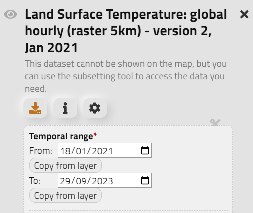
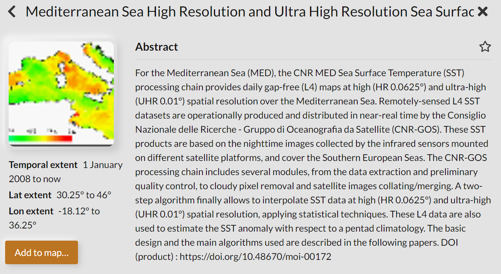
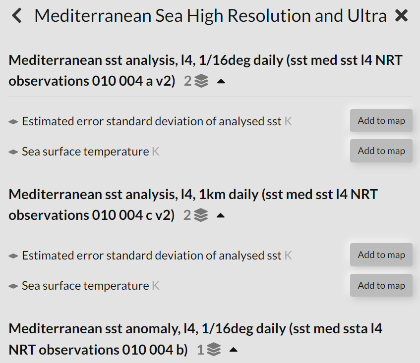

Usage
=====

Building a CliMetLab query
---------------------------------------------------------------

The WEkEO CliMetLab Plugin gives access to a wide range of WEkEO datasets. All WEkEO datasets can be explored in the  `WEkEO Viewer <https://www.wekeo.eu/data?view=viewer>`_.

The CliMetLab WEkEO Datasets Plugin currently supports the datasets published by the Copernicus Land Monitoring Service (CLMS), ECMWF and the Copernicus Marine Service.

A dataset can be accessed using CliMatLab with the ``load_dataset`` function.
The minimum required argument for the function ``load_dataset`` is the dataset id.

The CliMetLab dataset id can be derived from the dataset id inside the WEkEO viewer. For example:

- WEkEO dataset id: ``EO:CLMS:DAT:CGLS_HOURLY_LST_GLOBAL_V2``
- CliMetLab dataset id: ``wekeo-clms-cgls-hourly-lst-global-v2``

.. note::
     The datasets of the Copernicus Marine Service are structured as datasets with one to many sub-datasets, also calles **layers**, that belong in the dataset group.
     Using the CliMetLab one layer can be downloaded at a time.
     Therefore, the ``load_dataset`` function needs an additional argument ``layer`` for datasets which contain more than one layer.

.. code-block:: python

    import climetlab as cml

    ds = cml.load_dataset("wekeo-clms-cgls-hourly-lst-global-v2")

This code will download all available data in this dataset. As this means the download of large volumes of data (not advised),
it is necessary to further subset the query by dataset attributes. There are two ways to find the available attributes for each dataset:

1. Explore attributes in the `WEkEO Viewer <https://www.wekeo.eu/data?view=viewer>`_

2. Explore attributes in the Plugin source code

Each dataset is described with its attributes in a separate python file in the `plugin source code <https://github.com/wekeo/climetlab-wekeo-datasets>`_.

The above-described Land Surface Temperature (LST) dataset can be found `here <https://github.com/wekeo/climetlab-wekeo-datasets/blob/main/climetlab_wekeo_datasets/clms/cgls_hourly_lst_global_v2.py>`_.

.. note::
    Many dataset attributes are subject to selection constraints and not all combinations of attributes are possible. It is advised to check the combination of the selection in the WEkEO Viewer before creating a CliMetLab query to avoid errors of empty queries.

Now, a CliMetLab query for WEkEO data can be created:

.. code-block:: python

    import climetlab as cml

    ds = cml.load_dataset(
        "wekeo-clms-cgls-hourly-lst-global-v2",
        start="2021-07-01T00:00:00Z",
        end="2021-07-01T23:59:59Z",
    )

Copernicus Marine Service
-------------------------

To find out which layers and variables are available for a dataset, there are two options:

1. Explore layers and attributes in the `WEkEO Viewer <https://www.wekeo.eu/data?view=viewer>`_

The datasets are available in the WEkEO Catalogue.

When klicking on "Add to map..." the available layers are shown.

The layer of choice can then be added to the WEkEO Viewer, where the availabe attributes for subsetting the dataset are shown as well.
By examining the WEkEO API request, the exact names of the layers and attributes are shown as they are requires for the CliMetLab ``load_dataset`` request.

Accessing a single dataset through CliMetLab
--------------------------------------------

This query triggers the download of a subset of a single dataset.

.. code-block:: python

    import climetlab as cml

    ds = cml.load_dataset(
        "wekeo-clms-cgls-hourly-lst-global-v2",
        start="2021-07-01T00:00:00Z",
        end="2021-07-01T23:59:59Z",
    )

The download result is stored in chache. Running again the `cml.load_dataset` for the same dataset and the identical parameters will not trigger a new download, but will use the cached data instead.

After downloading, the dataset can be converted to xarray using the `to_xarray` function:

.. code-block:: python

    xarr = ds.to_xarray()
    xarr

Using the python `xarray` module, the dataset can be analyzed and plotted.

.. code-block:: python

    #create a spatial subset of the data

    lst_spain = xarr.sel( lat=slice(44.1, 35.6), lon = slice(-10, 4))[['LST']]
    lst_spain.attrs["title"] = "LST Spain 2021-07-01"

    # summarize the mean LST for the area of Spain

    lst_spain.LST.mean(dim=["lat", "lon"]).plot.line(x="time")
    plt.title ("LST Spain Diurnal Cycle 2021-07-01")

.. image:: ../images/lst-line-plot.png
    :width: 400

Working with two or more datasets using CliMetLab
-------------------------------------------------

In many cases it is necessary to combine more datasets and variables for data analysis.
Using the WEkEO CliMetLab Plugin, datasets from different sources can be downloaded and combined.

The LST dataset used in the previous sections is available in the date range betweel ``2021-01-18`` and today.
If we want to compare the LST of 2021-07-01 with the LST of the previous year, it is necessary to query the Version 1 of the dataset:
``wekeo-clms-cgls-hourly-lst-global-v1`` and combine it with the new version of the dataset.

.. code-block:: python

    import climetlab as cml
    import xarray as xr
    import matplotlib.pyplot as plt

    ds_v1 = cml.load_dataset(
        "wekeo-clms-cgls-hourly-lst-global-v1",
        start="2020-07-01T00:00:00Z",
        end="2020-07-01T23:59:59Z",
    )

    #convert to xarray
    xarr_v1 = ds_v1.to_xarray

    #concatenate along the time dimension to have a consecutive time series
    lst = xr.concat([xarr, xarr_v1], dim="time")

    #compare the two dates within one plot
    import matplotlib.pyplot as plt

    lst_spain.groupby("time.hour").mean(dim=["lat", "lon", "time"]).LST.plot.line(x="hour", label="mean 2020 2021")
    lst_spain.isel(time=(lst_spain.time.dt.year == 2020)).groupby("time.hour").mean(dim=["lat", "lon", "time"]).LST.plot.line(x="hour", label = "2020")
    lst_spain.isel(time=(lst_spain.time.dt.year == 2021)).groupby("time.hour").mean(dim=["lat", "lon", "time"]).LST.plot.line(x="hour", add_legend = True, label="2021")
    plt.legend()
    plt.title ("LST Spain comparison 2020-07-01 and 2021-07-01")

.. image:: ../images/lst-line-comparison.png
    :width: 400

Handling Merge errors
---------------------

The ``to_xarray`` function is not supported for all datasets depending of the datasets' shape and variable names. In such cases the following error will occur:

.. error::
    MergeError: Cannot safely merge your data. Try to download a single variable or loop over the files and call `to_xarray` on each one.

The ``ECMWF:SIS:WATER:HYDROLOGICAL:CHANGE`` dataset is one example:

.. code-block:: python

    ds=cml.load_dataset(
    "wekeo-ecmwf-sis-water-hydrological-change",
    variable=[
        "air_temperature",
        "precipitation"],
    time_aggregation=["autumn", "spring"],
    format_="zip",
    gcm_model="esm_chem",
    statistic="change_in_the_annual_mean",
    experiment="rcp_8_5",
    hydrological_model="pcr_globwb")

    xarr.to_xarray()

This raises the error:

.. error::
    MergeError: Cannot safely merge your data.
    Try to download a single variable or loop over the files and call `to_xarray` on each one.
    Original exception: conflicting values for variable 'ref_var_threshold' on objects to be combined. You can skip this check by specifying compat='override'.

The original exception reveals that the datasets have identical variable names, which is why they cannot be merged to a single xarray.

The single datasets downloaded by CliMetLab can be accessed by ``ds.source.sources``. In a loop each dataset can be converted to xarray separetely.

.. code-block:: python

    import xarray as xr
    datasets = [xr.open_dataset(s) for s in cmlds.source.sources]

The datasets can be merged after manually changing theit variable names using xarray.

.. code-block:: python

    datasets[0] = datasets[0].rename({"relative_change": "prec_relative_change"})
    datasets[0] = datasets[0].rename({"ref_var_threshold": "prec_ref_var_threshold"})[['prec_relative_change', 'prec_ref_var_threshold']]

    datasets[1] = datasets[1].rename({"absolute_change": "temp_absolute_change"})
    datasets[1] = datasets[1].rename({"ref_var_threshold": "temp_ref_var_threshold"})[['temp_absolute_change', 'temp_ref_var_threshold']]

    xarr = xr.merge(datasets)

Caching and Storage of CliMetLab datasets
-----------------------------------------

The CliMetLab source module works with caching instead of simply storing files in the local file system.
This brings the advantage that the user does not have to clean up the local disk, but the files will be removed automatically when the cache is cleared.

.. warning::

    When working with large datasets the files will fill up the computers cache, or the data cannot be fully downloaded if the queried volume does not fit fully in cache.

For large volumes of data it is recommended to change the default location where CliMetLab stores the data from cache to a large disk or object storage.
All benefits of the data management of CliMetLab remain, except the datasets are not deleted when the cache is cleared. They will be persistent on the drive instead.

.. code-block:: python

     import climetlab as cml

     cml.settings.get("cache-directory") # Find the current cache directory

     "/tmp/climetlab-$USER"

     # Change the value of the setting
     cml.settings.set("cache-directory", "/big-disk/climetlab-cache")

     # Python kernel restarted

     import climetlab as cml
     cml.settings.get("cache-directory") # Cache directory has been modified

     "/big-disk/climetlab-cache"

More information on caching can be found in the official documentation of CliMetLab (`Caching <https://climetlab.readthedocs.io/en/latest/guide/caching.html>`_).

